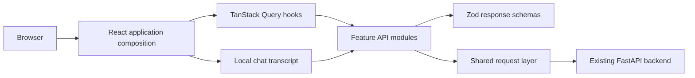
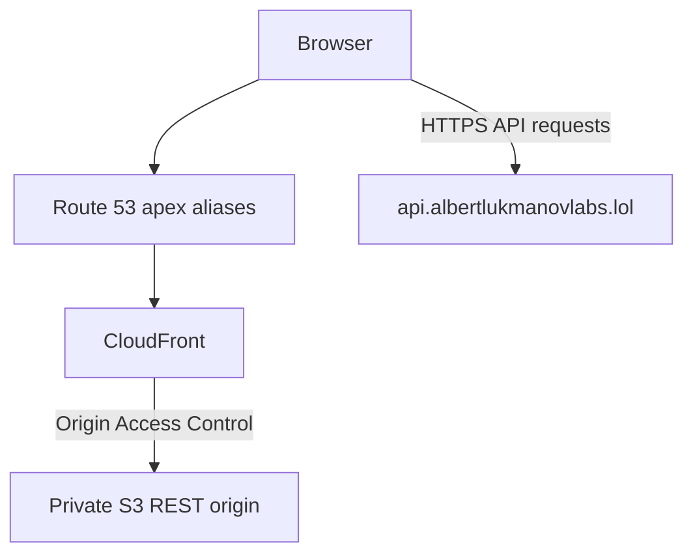

# Doc Helper AI Agent Web

A responsive React interface for demonstrating a document-grounded AI agent. It
surfaces backend answers, classifications, tool activity, sources, escalation
state, and trace IDs so the workflow remains inspectable.

> **Portfolio demonstration only.** This application is not a medical product,
> does not provide diagnosis or treatment, and must not be used with real patient
> data. Urgent or life-threatening situations require local emergency services or
> an appropriate qualified professional.

## Project Status

- Frontend application and local quality gate: implemented
- Production API: `https://api.albertlukmanovlabs.lol`
- API documentation: <https://api.albertlukmanovlabs.lol/docs>
- Intended frontend URL: `https://albertlukmanovlabs.lol` (not deployment-verified)
- CI and deployment workflow definitions: present but not run by this change
- Terraform and AWS provisioning: not present
- Apex DNS and backend CORS changes: external blockers

The intended frontend URL is a target, not evidence that this working tree has
been deployed. No AWS resource, DNS record, or backend CORS setting was changed or
verified as part of the frontend work.

## Implemented Features

- Responsive agent workspace for mobile, tablet, and desktop
- Multiline composer with Enter and Shift+Enter behavior
- Starter prompts for general, pricing, appointment, policy, and safety routes
- TanStack Query ownership for health, document, and chat request lifecycles
- Zod validation of all consumed API responses
- Visible classifications, tool results, sources, and copyable trace IDs
- Calm, prominent safety and human-escalation states
- Health polling and knowledge-base metadata with retry states
- Request cancellation, a 25-second timeout, retry, and safe error messages
- In-memory conversation history with only the session ID stored locally
- Keyboard focus states, semantic markup, live regions, and reduced-motion support
- Recursive redaction of sensitive-looking keys before displaying tool data
- Vitest and React Testing Library coverage isolated from the deployed API by MSW

## Architecture



Visual components do not call `fetch` directly. Feature hooks own Query and local
state, feature API modules parse unknown responses with Zod, and the shared
request layer owns transport, timeout, cancellation, and safe error conversion.
Conversation messages stay in React state rather than Query cache or browser
storage. See [docs/architecture.md](docs/architecture.md).

## Technology

- React 19 and React DOM
- TypeScript 6 with strict mode enabled
- Vite 8
- TanStack Query 5
- Zod 4
- Native `fetch` and `AbortController`
- CSS Modules and global design tokens
- Vitest, jsdom, React Testing Library, user-event, and MSW
- ESLint and Prettier

## Local Development

Prerequisites:

- Node.js 22, as recorded in `.nvmrc`
- npm
- Backend access, or a contract-compatible backend running locally

```bash
npm install
npm run dev
```

Vite prints the local URL, normally `http://localhost:5173`.

### Configuration

All frontend environment variables are public build-time values. Never put
secrets in a `VITE_` variable.

| Variable                     | Default                              | Purpose                                      |
| ---------------------------- | ------------------------------------ | -------------------------------------------- |
| `VITE_API_BASE_URL`          | `https://api.albertlukmanovlabs.lol` | Backend origin; trailing slashes are removed |
| `VITE_APP_ENV`               | `local`                              | Environment label available to the frontend  |
| `VITE_GITHUB_REPOSITORY_URL` | Project GitHub URL                   | Header source link                           |

For a local backend, use a local Vite environment file:

```dotenv
VITE_API_BASE_URL=http://localhost:8000
VITE_APP_ENV=local
VITE_GITHUB_REPOSITORY_URL=
```

`src/app/config.ts` validates the API URL during application startup.

## Quality Commands

```text
npm run lint
npm run format:check
npm run typecheck
npm run test:run
npm run build
```

`npm run test:run` uses local MSW handlers and does not call the deployed API.
`npm run build` runs the TypeScript project build before Vite writes `dist/`.
Use `npm run format` to apply repository formatting.

## CI Behavior

`.github/workflows/ci.yml` runs on pull requests targeting `main` and pushes to
`main`. It installs with `npm ci`, runs all five quality commands, and uploads the
tested `dist` artifact for that commit. The CI workflow has read-only repository
permission and no AWS credentials or deployment step.

`.github/workflows/deploy.yml` is a separate deployment definition. Its quality
job references the GitHub `production` environment, runs the same gate with its
environment-scoped public build values, and passes the tested artifact to a
separately protected OIDC-based deployment job. Environment protection may gate
the build and deploy jobs separately. Only deploy can request an OIDC token. The
workflow depends on pre-provisioned AWS resources and GitHub environment values;
this change did not run it or verify a production deployment.

## API Contract

The frontend consumes:

| Method | Path             | Purpose                               |
| ------ | ---------------- | ------------------------------------- |
| `GET`  | `/health`        | API status, service name, and version |
| `GET`  | `/api/documents` | Document names and chunk totals       |
| `POST` | `/api/chat`      | Agent answer and workflow metadata    |

Responses remain `unknown` until their endpoint Zod schema succeeds. See
[docs/api.md](docs/api.md) for exact shapes, defaults, and error behavior.

## Safety And Privacy

- The interface never adds diagnosis, medication, or treatment advice.
- Emergency and human-escalation responses receive a visible warning.
- The UI never claims emergency services, a callback, appointment, or ticket was
  created unless a successful backend action explicitly confirms it.
- Message contents are not written to `localStorage`.
- Clearing the conversation cancels an active request and rotates the session.
- Tool output is rendered as text, never arbitrary HTML.
- Sensitive-looking keys are removed from structured tool previews.
- Examples and automated test fixtures are fictional and non-identifying.

## Repository Layout

```text
.
|-- .agent/                    Focused context and task tracking
|-- .github/workflows/         CI and deployment workflow definitions
|-- docs/                      Maintainer documentation
|-- public/                    Static browser assets
`-- src/
    |-- app/                   Configuration and application providers
    |-- features/              Chat, documents, and health ownership
    |-- shared/                API, UI, hooks, and formatting utilities
    |-- styles/                Reset, tokens, globals, and CSS Module styles
    `-- test/                  Fictional fixtures and MSW test infrastructure
```

## Intended Deployment Topology



The intended design uses a private S3 origin behind CloudFront OAC, Route 53 apex
aliases, and an ACM certificate in `us-east-1`. No Terraform is present and no AWS
resources were provisioned or verified. Production browser integration also
requires the separately owned backend CORS allowlist and apex DNS records. See
[docs/deployment.md](docs/deployment.md).

## Known Limitations

- The frontend URL and production workflow have not been deployment-verified.
- AWS infrastructure, apex DNS, and backend CORS remain external work.
- No authentication or user accounts
- No persisted chat history
- No streaming responses
- No document upload or administration UI
- The pseudonymous user ID is regenerated on each page load

Deferred work belongs in [docs/roadmap.md](docs/roadmap.md) and
[.agent/tasks/backlog.md](.agent/tasks/backlog.md).

## Fictional Demonstration Walkthrough

Use fictional prompts only; do not enter patient or identifying data.

1. Check the header's API status indicator.
2. Ask, "What are the demonstration office hours?" and inspect the classification.
3. Ask, "What is the fictional whitening price?" and inspect sources and tool data.
4. Use the appointment starter prompt and verify actions are reported, not assumed.
5. Use the marked safety prompt and verify the professional-help warning appears.
6. Copy a trace ID, then clear the conversation to rotate the session.

## Documentation

- [Architecture](docs/architecture.md)
- [API contract](docs/api.md)
- [Conventions](docs/conventions.md)
- [Deployment](docs/deployment.md)
- [Roadmap](docs/roadmap.md)
