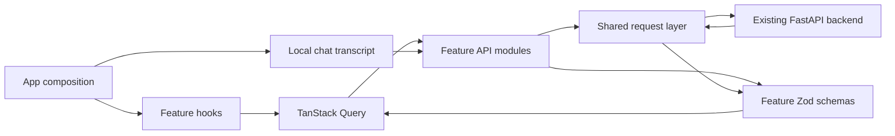
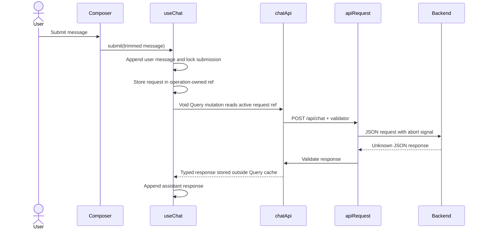

# Architecture

## Purpose

The frontend demonstrates how an AI agent classifies a request, grounds an answer
in documents, invokes tools, escalates when appropriate, and exposes a trace for
inspection. It is a static browser application connected to an independently
deployed backend.

## Runtime Boundaries

### Application shell

`src/App.tsx` composes the persistent header, API health indicator, safety banner,
chat feature, document summary, and footer. `src/app/providers.tsx` supplies the
application Query client, while `src/app/config.ts` validates runtime
configuration at module initialization.

### Feature ownership

- `src/features/chat` owns the no-retry Query mutation, in-memory transcript,
  composer, assistant metadata, tool disclosures, safety notices, sources, and
  trace IDs.
- `src/features/health` owns health response validation, Query-backed status
  mapping, and conservative 45-second polling.
- `src/features/documents` owns document response validation, Query-backed
  loading and retry state, and the knowledge-base summary.

Feature components may import from `src/shared`, but features do not reach into one
another's internals. Cross-feature composition belongs at the application level:
`App.tsx` obtains health state and injects `KnowledgeBaseSummary` into
`ChatFeature.tsx` rather than making chat import the documents feature.

### Shared ownership

- `src/shared/api/request.ts` owns URL construction, headers, safe JSON parsing,
  timeout and abort behavior, error-envelope parsing, and validation dispatch.
- `src/shared/api/ApiError.ts` owns typed error metadata and user-safe messages.
- `src/shared/hooks/usePersistentSession.ts` owns pseudonymous identifiers and
  session persistence.
- `src/shared/components/Icon.tsx` contains the local icon vocabulary.
- `src/shared/lib/format.ts` owns labels, trace formatting, and structured-result
  redaction.

## State Ownership

| State                        | Owner                        | Persistence                          |
| ---------------------------- | ---------------------------- | ------------------------------------ |
| Conversation messages        | `useChat`                    | Memory only                          |
| Chat mutation lifecycle      | `useChat` / Query mutation   | Payload-free; retry off; `gcTime: 0` |
| Chat error and retry payload | `useChat`                    | None                                 |
| Session ID                   | `usePersistentSession`       | `localStorage`                       |
| Pseudonymous user ID         | `usePersistentSession`       | Memory; recreated on reload          |
| Composer draft               | `ChatFeature`                | Memory only                          |
| Health response              | `useHealth` / Query cache    | Memory; polled every 45 seconds      |
| Document summary             | `useDocuments` / Query cache | Memory; fetched on mount             |

Clearing a conversation aborts the active request, discards visible messages,
clears the error, and rotates the session ID. Message content is never written to
browser storage by this application.

## Request Flow

All responses remain `unknown` until the endpoint's Zod schema succeeds. Health,
documents, and chat use separate feature schemas. The chat schema defaults omitted
`actions` and `sources` to empty arrays, `requires_human` to `false`, and an
omitted action `result` to `null`; a present result must be a record object.
Documents default omitted document lists and totals to empty/zero values.
Classifications and action statuses remain strict enums. Invalid JSON and schema
mismatches become `ApiError` instances rather than partially rendered data.

The shared request layer combines safe metadata from root and object-valued
`detail` error envelopes, with nested values preferred per field and
`X-Trace-Id` used as a trace fallback. Its internal timeout controller forwards
caller cancellation. Query supplies abort signals for health and documents;
`useChat` supplies an active controller so clear and unmount cancel the mutation.
The chat mutation receives no variables and returns no response data. It catches
request failures before Query can store them, then `execute` maps the
operation-owned cause to local error UI after the void mutation resolves. Request,
response, and failure refs are ownership-checked, cleared after
completion/clear/unmount, and the zero-retention mutation is reset after each
operation.

## Presentation Architecture

The visual system uses:

- `reset.css` for normalized browser behavior;
- `tokens.css` for colors, spacing, typography, radii, shadows, and focus rings;
- `global.css` for body-level behavior and motion preferences;
- `ui.module.css` for the application and feature component styles.

The layout is a chat workspace with a contextual side rail on large screens. The
rail moves below the chat at tablet and mobile widths. Stable dimensions, minimum
touch targets, visible focus states, semantic controls, live regions, and
`prefers-reduced-motion` handling are part of the component contract. A polite,
atomic assistant-response region exists from initial mount, stays empty for the
welcome message, clears during each pending request, and remains empty if that
request fails. A completed assistant answer repopulates it; the empty transition
ensures consecutive identical answers are announced again without re-announcing a
historical answer alongside a newer error.

## Dependency Strategy

The runtime uses React, React DOM, TanStack Query for cancellable server state,
and Zod for response validation. Conversation messages remain in local React
state rather than the Query cache. Do not add a state manager or UI framework
unless a real maintenance or behavior need outweighs the added surface area.

## Deployment Boundary

Vite produces static assets in `dist/`. Frontend CI, deployment, and backendless
Terraform validation workflow definitions are present. Frontend-only Terraform
under `infra/terraform` owns the CloudFront, private S3 REST origin, ACM, Route 53,
and deployment-IAM topology. That stack and its apex/`www` DNS aliases were applied
and infrastructure-verified on 2026-07-14. Frontend assets have not been deployed,
and the browser continues to call the independently owned API over HTTPS. GitHub
environment setup, deployment, and backend CORS remain release blockers. See
[deployment.md](deployment.md) and
[`infra/terraform/README.md`](../infra/terraform/README.md) for operational
boundaries.
