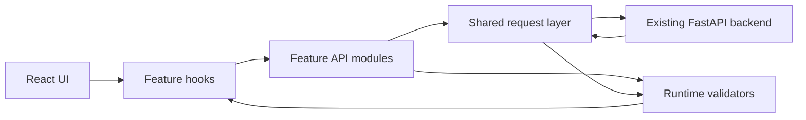
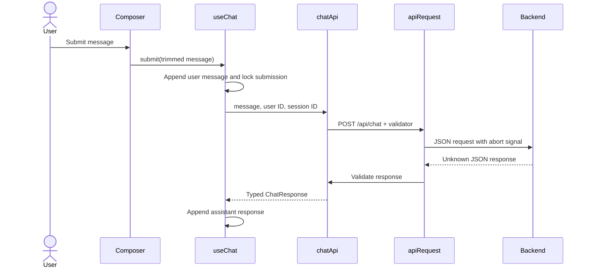

# Architecture

## Purpose

The frontend demonstrates how an AI agent classifies a request, grounds an answer
in documents, invokes tools, escalates when appropriate, and exposes a trace for
inspection. It is a static browser application connected to an independently
deployed backend.

## Runtime Boundaries

### Application shell

`src/App.tsx` composes the persistent header, API health indicator, safety banner,
chat feature, and footer. `src/app/config.ts` is the only configuration entry
point and validates the backend origin at module initialization.

### Feature ownership

- `src/features/chat` owns the mutation lifecycle, in-memory transcript, composer,
  assistant metadata, tool disclosures, safety notices, sources, and trace IDs.
- `src/features/health` owns health response validation, status mapping, and
  conservative 45-second polling.
- `src/features/documents` owns document response validation, one-time loading,
  retry state, and the knowledge-base summary.

Feature components may import from `src/shared`, but features should not reach
into one another's internal API or hook modules. Composition between features
belongs at a common parent such as `ChatFeature.tsx` or `App.tsx`.

### Shared ownership

- `src/shared/api/request.ts` owns URL construction, headers, safe JSON parsing,
  timeout and abort behavior, error-envelope parsing, and validation dispatch.
- `src/shared/api/ApiError.ts` owns typed error metadata and user-safe messages.
- `src/shared/api/validation.ts` contains small reusable runtime assertions.
- `src/shared/hooks/usePersistentSession.ts` owns pseudonymous identifiers and
  session persistence.
- `src/shared/components/Icon.tsx` contains the local icon vocabulary.
- `src/shared/lib/format.ts` owns labels, trace formatting, and structured-result
  redaction.

## State Ownership

| State | Owner | Persistence |
| --- | --- | --- |
| Conversation messages | `useChat` | Memory only |
| Pending chat request | `useChat` | None |
| Chat error and retry payload | `useChat` | None |
| Session ID | `usePersistentSession` | `localStorage` |
| Pseudonymous user ID | `usePersistentSession` | Memory; recreated on reload |
| Composer draft | `ChatFeature` | Memory only |
| Health response | `useHealth` | Memory; polled every 45 seconds |
| Document summary | `useDocuments` | Memory; fetched on mount |

Clearing a conversation aborts the active request, discards visible messages,
clears the error, and rotates the session ID. Message content is never written to
browser storage by this application.

## Request Flow

All responses remain `unknown` until the endpoint validator succeeds. Invalid JSON
and schema mismatches become `ApiError` instances rather than partially rendered
data.

## Presentation Architecture

The visual system uses:

- `reset.css` for normalized browser behavior;
- `tokens.css` for colors, spacing, typography, radii, shadows, and focus rings;
- `global.css` for body-level behavior and motion preferences;
- `ui.module.css` for the application and feature component styles.

The layout is a chat workspace with a contextual side rail on large screens. The
rail moves below the chat at tablet and mobile widths. Stable dimensions, minimum
touch targets, visible focus states, semantic controls, live regions, and
`prefers-reduced-motion` handling are part of the component contract.

## Dependency Strategy

The runtime depends only on React and React DOM. Server state and mutations are
implemented with focused hooks, while API validation uses local TypeScript guards.
Do not add a state manager, UI framework, or validation dependency unless a real
maintenance or behavior need outweighs the added surface area.

## Deployment Boundary

Vite produces static assets in `dist/`. The intended deployment is CloudFront in
front of a private S3 REST origin, while the browser calls the existing API over
HTTPS. Infrastructure is not currently implemented in this repository. See
[deployment.md](deployment.md) for the target topology and operational contract.