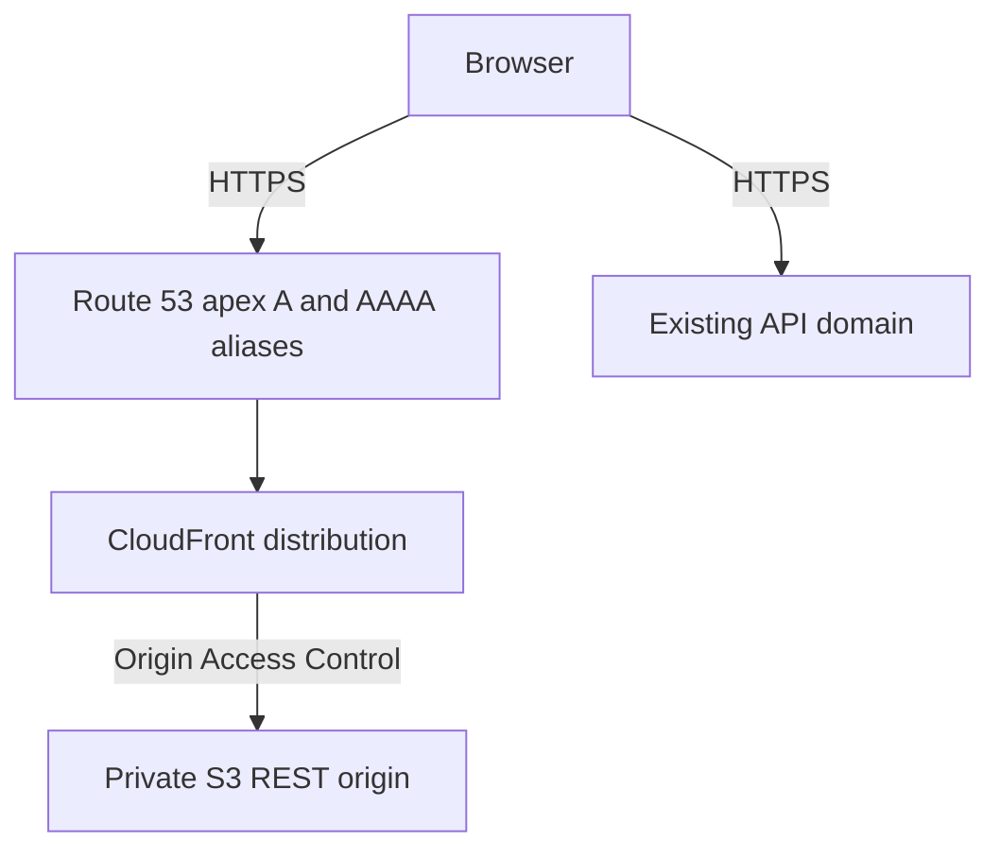

# Deployment

## Current State

The repository currently contains the static frontend source only. It does not
contain Terraform, GitHub Actions deployment workflows, or proof of a production
deployment. The intended production URL is:

```text
https://albertlukmanovlabs.lol
```

The existing backend remains independently deployed at:

```text
https://api.albertlukmanovlabs.lol
```

Do not claim the frontend is deployed until the production URL is smoke-tested.

## Build Contract

Vite reads public configuration at build time and writes the static site to
`dist/`.

```bash
VITE_API_BASE_URL=https://api.albertlukmanovlabs.lol npm run build
```

Required production values:

| Variable | Value |
| --- | --- |
| `VITE_API_BASE_URL` | `https://api.albertlukmanovlabs.lol` |
| `VITE_APP_ENV` | `production` |
| `VITE_GITHUB_REPOSITORY_URL` | Public project repository URL |

`VITE_` values are embedded in browser assets and must never contain secrets.

## Target AWS Topology



The desired infrastructure consists of:

- the existing Route 53 hosted zone for `albertlukmanovlabs.lol`;
- a private, encrypted, versioned S3 bucket with Block Public Access enabled;
- CloudFront using Origin Access Control and the S3 REST endpoint;
- an ACM certificate created in `us-east-1`;
- Route 53 A and AAAA aliases for the apex domain;
- optional A and AAAA aliases for `www`;
- HTTP-to-HTTPS redirects, compression, HTTP/2, and HTTP/3 where supported;
- security response headers;
- `index.html` as the default root object;
- SPA fallbacks mapping origin `403` and `404` to `/index.html` with status `200`.

Public S3 website hosting is not part of the design.

## Terraform Contract

If Terraform is added, it should live under `infra/terraform` and use the existing
remote-state bucket with a frontend-specific key:

```hcl
terraform {
  backend "s3" {
    bucket       = "albertlukmanovlabs-terraform-state-964866958896"
    key          = "doc-helper-ai-agent-web/prod/terraform.tfstate"
    region       = "us-east-1"
    encrypt      = true
    use_lockfile = true
  }
}
```

Expected outputs:

- `frontend_bucket_name`
- `cloudfront_distribution_id`
- `cloudfront_distribution_domain`
- `frontend_url`
- `github_deploy_role_arn`
- `certificate_arn`

Validation must include `terraform fmt -check -recursive`, initialization without
the production backend for CI validation, and `terraform validate`. Infrastructure
must never be applied automatically from pull-request CI.

## Deployment Identity

A future GitHub deployment workflow should use OIDC and a frontend-specific IAM
role. The trust subject must be limited to:

```text
repo:etonealbert/doc-helper-ai-agent-web:environment:production
```

The role needs only:

- frontend bucket listing and location lookup;
- frontend object upload and stale-object deletion;
- creation and inspection of invalidations for the one CloudFront distribution.

It must not receive ECS, ECR, DynamoDB, Route 53, broad IAM, or backend deployment
permissions. Long-lived AWS access keys must not be stored in GitHub.

## Cache Policy

Upload Vite fingerprinted assets under `dist/assets` with:

```text
Cache-Control: public,max-age=31536000,immutable
```

Upload `index.html` with:

```text
Cache-Control: no-cache,no-store,must-revalidate
```

Other non-fingerprinted files should use a short cache lifetime, such as five
minutes. Invalidate only `/` and `/index.html` after deployment unless a wider
invalidation has a documented reason.

## Backend CORS Requirement

Before browser integration can work in production, the backend allowlist must
include:

```text
https://albertlukmanovlabs.lol
https://www.albertlukmanovlabs.lol
```

Local development may also include `http://localhost:5173`. Recommended behavior:

- `allow_credentials=false`;
- methods `GET`, `POST`, and `OPTIONS`;
- only required request headers;
- expose `X-Trace-Id`;
- no wildcard production origins.

This change belongs in the backend repository, not here.

## Future GitHub Environment

The protected `production` environment should define non-secret variables:

```text
AWS_REGION=us-east-1
AWS_ROLE_ARN=<terraform output>
FRONTEND_BUCKET_NAME=<terraform output>
CLOUDFRONT_DISTRIBUTION_ID=<terraform output>
FRONTEND_URL=https://albertlukmanovlabs.lol
VITE_API_BASE_URL=https://api.albertlukmanovlabs.lol
```

## Release Verification

After infrastructure and workflow implementation, verify:

1. The quality checks and production build complete successfully.
2. The exact tested `dist/` artifact is uploaded.
3. CloudFront serves the current `index.html` and fingerprinted assets.
4. The header reports the API as online without browser CORS errors.
5. Opening-hours and pricing prompts return grounded answers and sources.
6. Appointment actions and safety escalation render accurately.
7. Trace ID copying works.
8. The 360px layout remains usable.
9. Reloading a future client-side route returns the SPA shell rather than S3
   `403` or `404` content.

AWS provisioning, workflow creation, commits, pushes, and backend CORS changes
require explicit user authorization.