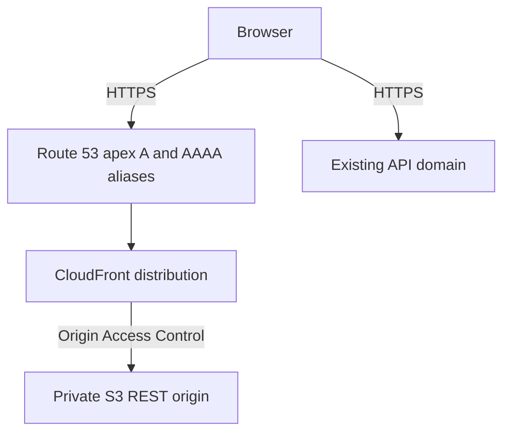

# Deployment

## Current State

The repository contains a Vite static frontend, frontend CI and deployment
workflow definitions, and frontend-only Terraform with a backendless validation
workflow. The Terraform stack was applied and infrastructure-verified on
2026-07-14: the private S3 origin, CloudFront distribution, ACM certificate,
Route 53 apex/`www` aliases, and GitHub OIDC role exist. No deployment workflow was
run, no frontend assets were uploaded, and backend CORS was not changed or
verified.

Provisioned frontend URL (application not deployed):

```text
https://albertlukmanovlabs.lol
```

Independently deployed backend:

```text
https://api.albertlukmanovlabs.lol
```

Do not present the frontend application as live until assets are deployed, backend
CORS and GitHub environment configuration are complete, and the URL passes a
production smoke test. The empty private origin currently returns an expected
CloudFront `403`.

## Build Contract

Vite reads public configuration at build time and writes static assets to `dist/`.

```powershell
$env:VITE_API_BASE_URL = "https://api.albertlukmanovlabs.lol"
$env:VITE_APP_ENV = "production"
npm run build
```

Required production values:

| Variable                     | Value                                |
| ---------------------------- | ------------------------------------ |
| `VITE_API_BASE_URL`          | `https://api.albertlukmanovlabs.lol` |
| `VITE_APP_ENV`               | `production`                         |
| `VITE_GITHUB_REPOSITORY_URL` | Public project repository URL        |

`VITE_` values are embedded in browser assets and must never contain secrets.

## Workflow Definitions

`.github/workflows/ci.yml` runs for pull requests targeting `main` and pushes to
`main`. It uses Node from `.nvmrc`, installs with `npm ci`, runs formatting, lint,
type checking, tests, and the production build, then uploads `dist` as a
commit-addressed artifact. It has no AWS credential or deployment step.

`.github/workflows/deploy.yml` separately defines an artifact-based production
release. Its quality job references the GitHub `production` environment so
environment-scoped `VITE_API_BASE_URL` is available before the production bundle
is built. Production environment protection therefore gates the build when
configured. The dependent deployment job also references `production`, downloads
that exact artifact, requests AWS credentials through GitHub OIDC, syncs files to
S3 with scoped cache headers, invalidates only `/` and `/index.html`, waits for
completion, and attempts a frontend smoke test. GitHub may require a separate
environment approval when the deploy job becomes eligible after quality passes.
Only the deploy job has `id-token: write`; the quality job has no OIDC permission.

The deployment definition is not evidence of a deployment. Its AWS resources are
provisioned, but it still requires GitHub production-environment values and has not
been run or verified by this change.

`.github/workflows/terraform.yml` is separately scoped to Terraform path changes.
It uses Terraform `1.10.5` to check formatting, initialize with the backend
disabled and the dependency lockfile read-only, and validate configuration. It has
only `contents: read`, receives no AWS credentials or OIDC permission, and never
runs plan or apply. The workflow definition has not run in GitHub; its audit,
format, initialization, and validation commands passed locally before apply.

## Provisioned AWS Topology



The intended topology uses a private S3 REST origin with Block Public Access,
CloudFront Origin Access Control, an ACM certificate in `us-east-1`, and Route 53
apex aliases. Public S3 website hosting is not part of the design.

Frontend Terraform owns this topology under `infra/terraform`, including a private
S3 origin, CloudFront OAC, ACM validation, apex and `www` aliases, and a constrained
deployment role. The topology was provisioned and verified on 2026-07-14.

## Terraform Operations

[../infra/terraform/README.md](../infra/terraform/README.md) is the authoritative
runbook for backendless validation, AWS account verification, saved plan creation,
JSON audit, exact saved-plan apply, outputs, costs, `prevent_destroy`, and deliberate
teardown. The plan-audit script fails closed: data reads are ignored, managed types
are allowlisted, and only exact `create` or `no-op` action arrays pass. Updates,
deletes, replacements, unexpected types, malformed JSON, and other action arrays
fail with a nonzero exit.

The successful apply produced these six non-sensitive outputs:

| Output                           | Value                                                                                 |
| -------------------------------- | ------------------------------------------------------------------------------------- |
| `frontend_bucket_name`           | `albertlukmanovlabs-lol-frontend-964866958896`                                        |
| `cloudfront_distribution_id`     | `EQ5KB7W9TDHZP`                                                                       |
| `cloudfront_distribution_domain` | `d3oa6c7grsn1bd.cloudfront.net`                                                       |
| `frontend_url`                   | `https://albertlukmanovlabs.lol`                                                      |
| `github_deploy_role_arn`         | `arn:aws:iam::964866958896:role/DocHelperFrontendGitHubDeployRole`                    |
| `certificate_arn`                | `arn:aws:acm:us-east-1:964866958896:certificate/e68688b4-8491-4f65-af46-9179b1591ba3` |

Outputs and infrastructure checks do not prove asset deployment, backend CORS, or
a working production application.

## Cache Contract

The deployment workflow defines:

- `dist/assets/*`: `public,max-age=31536000,immutable`
- `index.html`: `no-cache,no-store,must-revalidate`
- other public files: `public,max-age=300`
- CloudFront invalidation paths: `/` and `/index.html`

The production-environment quality and deployment jobs exchange the same
commit-addressed artifact; the deployment job does not rebuild it.

## External Release Blockers

### Backend CORS

The separately owned backend must allow:

```text
https://albertlukmanovlabs.lol
https://www.albertlukmanovlabs.lol
```

Local development may additionally allow `http://localhost:5173`. Production
guidance is `allow_credentials=false`, methods `GET`, `POST`, and `OPTIONS`, only
required request headers, exposed `X-Trace-Id`, and no wildcard origins.

This frontend work did not change or verify backend CORS.

### Frontend Assets

The apex and `www` A/AAAA aliases resolve to the deployed CloudFront distribution,
but the private bucket is empty. Configure the GitHub environment and run the
separately authorized deployment workflow before performing application smoke
tests.

### GitHub Environment

Terraform outputs supply the role, bucket, distribution, and frontend URL values
expected by the deployment workflow:

```text
AWS_REGION=us-east-1
AWS_ROLE_ARN=arn:aws:iam::964866958896:role/DocHelperFrontendGitHubDeployRole
FRONTEND_BUCKET_NAME=albertlukmanovlabs-lol-frontend-964866958896
CLOUDFRONT_DISTRIBUTION_ID=EQ5KB7W9TDHZP
FRONTEND_URL=https://albertlukmanovlabs.lol
VITE_API_BASE_URL=https://api.albertlukmanovlabs.lol
```

Their presence, protection rules, approval behavior, and correctness were not
verified. Environment-scoped build values are available only after the quality
job's production-environment gate is satisfied.

Configure these as variables under **Settings > Environments > production >
Environment variables**, not as Actions secrets. The workflow reads the `vars`
context; a value stored only in `secrets` is intentionally unavailable to these
expressions.

## Production Verification

After separately authorized CORS and deployment work, verify:

1. The exact quality-tested `dist` artifact is deployed.
2. HTTPS serves the current application shell and fingerprinted assets.
3. The API status loads without browser CORS errors.
4. The static shell loads in Spanish with matching `lang`, title, and description.
5. Spanish and English fictional opening-hours and pricing prompts return grounded
   answers and sources in the selected language.
6. Switching language preserves the draft, transcript, session, and any in-flight
   operation's original response language.
7. Appointment actions and safety escalation render in both languages without
   claiming unconfirmed outcomes.
8. Trace copying, the language control, and the 360px layout remain usable.
9. Reloading the frontend URL returns the Spanish application shell.

Until those checks succeed, the frontend URL remains intended and unverified.
