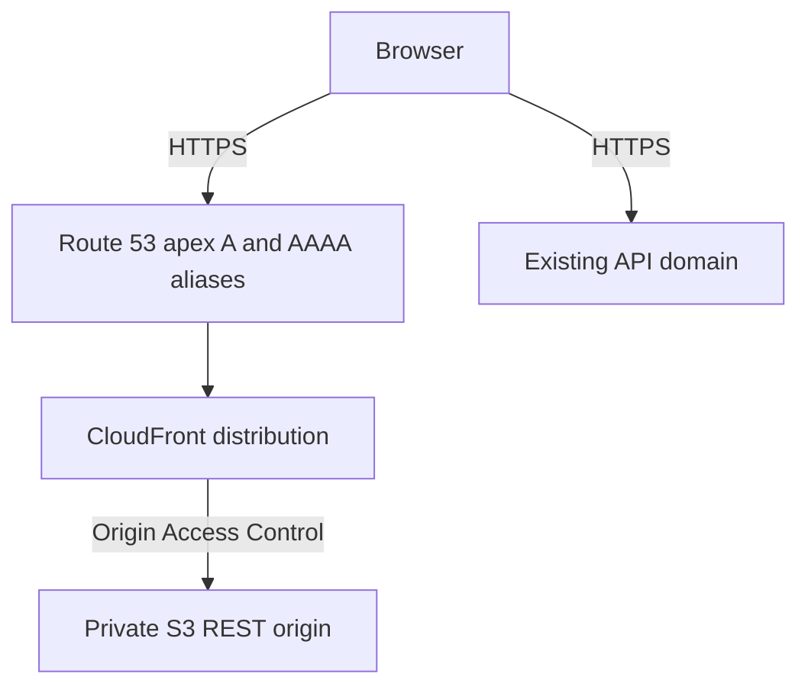

# Deployment

## Current State

The repository contains a Vite static frontend, a CI workflow, and a separate
deployment workflow definition. It does not contain Terraform or proof that the
required AWS resources, apex DNS records, or backend CORS allowlist exist. Neither
workflow was run by this change, and no production deployment was performed or
verified.

Intended frontend URL (unverified):

```text
https://albertlukmanovlabs.lol
```

Independently deployed backend:

```text
https://api.albertlukmanovlabs.lol
```

Do not present the intended frontend URL as live until the owning infrastructure
and external blockers are complete and the URL passes a production smoke test.

## Build Contract

Vite reads public configuration at build time and writes static assets to `dist/`.

```powershell
$env:VITE_API_BASE_URL = "https://api.albertlukmanovlabs.lol"
$env:VITE_APP_ENV = "production"
npm run build
```

Required production values:

| Variable                     | Value                                |
| ---------------------------- | ------------------------------------ |
| `VITE_API_BASE_URL`          | `https://api.albertlukmanovlabs.lol` |
| `VITE_APP_ENV`               | `production`                         |
| `VITE_GITHUB_REPOSITORY_URL` | Public project repository URL        |

`VITE_` values are embedded in browser assets and must never contain secrets.

## Workflow Definitions

`.github/workflows/ci.yml` runs for pull requests targeting `main` and pushes to
`main`. It uses Node from `.nvmrc`, installs with `npm ci`, runs formatting, lint,
type checking, tests, and the production build, then uploads `dist` as a
commit-addressed artifact. It has no AWS credential or deployment step.

`.github/workflows/deploy.yml` separately defines an artifact-based production
release. Its quality job references the GitHub `production` environment so
environment-scoped `VITE_API_BASE_URL` is available before the production bundle
is built. Production environment protection therefore gates the build when
configured. The dependent deployment job also references `production`, downloads
that exact artifact, requests AWS credentials through GitHub OIDC, syncs files to
S3 with scoped cache headers, invalidates only `/` and `/index.html`, waits for
completion, and attempts a frontend smoke test. GitHub may require a separate
environment approval when the deploy job becomes eligible after quality passes.
Only the deploy job has `id-token: write`; the quality job has no OIDC permission.

The deployment definition is not evidence of a deployment. It requires externally
provisioned AWS resources and GitHub production-environment values, and it has not
been run or verified by this change.

## Intended AWS Topology



The intended topology uses a private S3 REST origin with Block Public Access,
CloudFront Origin Access Control, an ACM certificate in `us-east-1`, and Route 53
apex aliases. Public S3 website hosting is not part of the design.

No Terraform exists in this repository, no AWS resources were provisioned or
changed, and the intended topology has not been verified. Infrastructure work is
tracked only as deferred work in [roadmap.md](roadmap.md) and
[../.agent/tasks/backlog.md](../.agent/tasks/backlog.md).

## Cache Contract

The deployment workflow defines:

- `dist/assets/*`: `public,max-age=31536000,immutable`
- `index.html`: `no-cache,no-store,must-revalidate`
- other public files: `public,max-age=300`
- CloudFront invalidation paths: `/` and `/index.html`

The production-environment quality and deployment jobs exchange the same
commit-addressed artifact; the deployment job does not rebuild it.

## External Release Blockers

### Backend CORS

The separately owned backend must allow:

```text
https://albertlukmanovlabs.lol
https://www.albertlukmanovlabs.lol
```

Local development may additionally allow `http://localhost:5173`. Production
guidance is `allow_credentials=false`, methods `GET`, `POST`, and `OPTIONS`, only
required request headers, exposed `X-Trace-Id`, and no wildcard origins.

This frontend work did not change or verify backend CORS.

### Apex DNS And AWS

The apex DNS aliases and all required AWS resources must be created and verified
in their owning systems. This frontend work did not create or inspect them.

### GitHub Environment

The deployment workflow expects externally supplied production values including:

```text
AWS_REGION=us-east-1
AWS_ROLE_ARN=<provisioned role ARN>
FRONTEND_BUCKET_NAME=<provisioned bucket name>
CLOUDFRONT_DISTRIBUTION_ID=<provisioned distribution ID>
FRONTEND_URL=https://albertlukmanovlabs.lol
VITE_API_BASE_URL=https://api.albertlukmanovlabs.lol
```

Their presence, protection rules, approval behavior, and correctness were not
verified. Environment-scoped build values are available only after the quality
job's production-environment gate is satisfied.

## Production Verification

After separately authorized infrastructure, DNS, CORS, and deployment work, verify:

1. The exact quality-tested `dist` artifact is deployed.
2. HTTPS serves the current application shell and fingerprinted assets.
3. The API status loads without browser CORS errors.
4. Fictional opening-hours and pricing prompts return grounded answers and sources.
5. Appointment actions and safety escalation render without claiming unconfirmed outcomes.
6. Trace copying and the 360px layout remain usable.
7. Reloading the frontend URL returns the application shell.

Until those checks succeed, the frontend URL remains intended and unverified.
